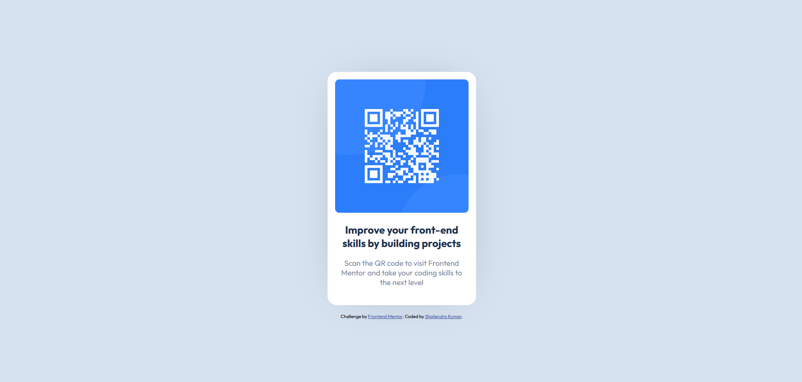

# Frontend Mentor - QR code component solution

This is a solution to the [QR code component challenge on Frontend Mentor](https://www.frontendmentor.io/challenges/qr-code-component-iux_sIO_H). Frontend Mentor challenges help you improve your coding skills by building realistic projects.

## Table of contents

- [Overview](#overview)
  - [Screenshot](#screenshot)
  - [Links](#links)
- [My process](#my-process)
  - [Built with](#built-with)
  - [What I learned](#what-i-learned)
  - [Continued development](#continued-development)
  - [Useful resources](#useful-resources)
- [Author](#author)
- [Acknowledgments](#acknowledgments)

## Overview

### Screenshot



### Links

- Solution URL: [Link to the Github](https://github.com/develover-sk/qr-code-design-replica)
- Live Site URL: [Live Site](https://develover-sk.github.io/qr-code-design-replica)

## My process

### Built with

- Semantic HTML5 markup
- CSS custom properties
- Flexbox
- VSCode

### What I learned

- Using this challenge, I learned how to contain image within a div contain of varying size.
- I learned using box-shadow for a very minimal shade of background shadow.
- Learnt how to add breakpoints for different device dimensions
- Learnt to replicate the design just by looking at the picture and picking the details from it.

```css
.qr-code {
  width: 100%;
  height: 100%;
  object-fit: contain;
}

.child-container {
  box-shadow: 1px 1px 100px -40px #a0a8b1;
}
```

### Continued development

Further, I will be building a dynamic QR generator which can generate a QR code based upon user input and which can be captured to share to other users.

### Useful resources

- [MDN Documentation of box-shadow](https://developer.mozilla.org/en-US/docs/Web/CSS/box-shadow) - It helped me implement box-shadow which adds the beauty to the div container without being obvious that there is shadow behind the container.

## Author

- Website - [Shailendra Kumar](https://www.shailendra.xyz)
- Frontend Mentor - [@develover-sk](https://www.frontendmentor.io/profile/develover-sk)
- X (Formely Twitter) - [@shailendrakrsk\_](https://www.twitter.com/shailendrakrsk_)

## Acknowledgments

A special thanks to Frontend Mentor for providing with design ideas to practice coding. Challenges from frontend mentor are helping me to restart my frontend development journey again, but now in a structured way.
